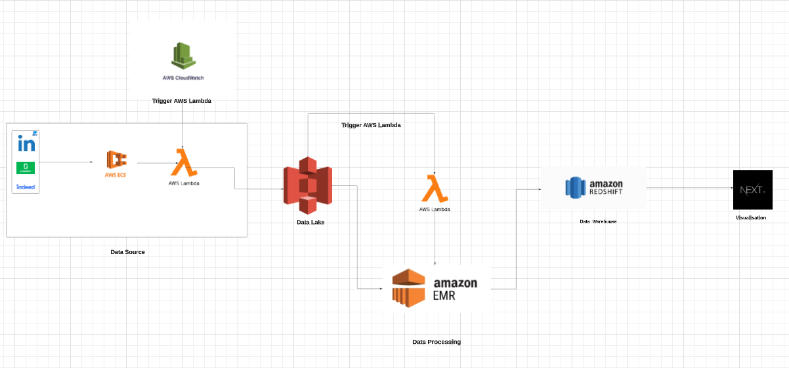

# AWS Version Of Job Offers Aggregator Project

This data engineering project automates the collection, processing, and storage of job offers data from LinkedIn, Glassdoor, and Indeed. The project leverages multiple AWS services for data collection, processing, and visualization.

## Features

- Data collection from LinkedIn, Glassdoor, and Indeed through web scraping.
- Data transformation and cleaning using Amazon EMR (Elastic MapReduce) with PySpark.
- Storing processed data in Amazon Redshift.
- Visualizing job offers on a web application with Next.js.
- Scheduled data processing using AWS Lambda and CloudWatch Events and S3 Event Trigger.

## Table of Contents

- [Architecture](#architecture)
- [Data Collection](#data-collection)
- [Data Processing](#data-processing)
- [Web Application](#web-application)
- [Contributing](#contributing)

## Architecture

This project follows a serverless architecture that makes use of several AWS services:

- **Data Collection**: Data is collected through web scraping from LinkedIn, Glassdoor, and Indeed. AWS Lambda functions are triggered upon data availability.

- **Data Processing**: Amazon EMR clusters with PySpark are used to process and clean the collected data. Processed data is then loaded into Amazon Redshift.

- **Web Application**: A web application built with Next.js retrieves job offers data from Amazon Redshift and displays it on a Google Map.

## Data Collection

Data is collected through web scraping from LinkedIn, Glassdoor, and Indeed. Custom AWS Lambda functions initiate data collection tasks when data becomes available on these platforms.

## Data Processing

Amazon EMR clusters with PySpark are used to process the collected data. PySpark jobs are submitted to clean, transform, and enrich the dataset. Processed data is then stored in Amazon Redshift.

## Web Application

A web application built with Next.js provides a user-friendly interface for visualizing job offers. The application displays job offers on a Google Map, along with details and links to the job postings.

## Contributing

We welcome contributions from the community! If you'd like to contribute to this project, please follow these guidelines:

1. Fork the repository.
2. Create a new branch for your feature or bug fix: `git checkout -b feature-name`.
3. Make your changes and commit them: `git commit -m "Description of your changes"`.
4. Push your changes to your fork: `git push origin feature-name`.
5. Submit a pull request to the main repository.
